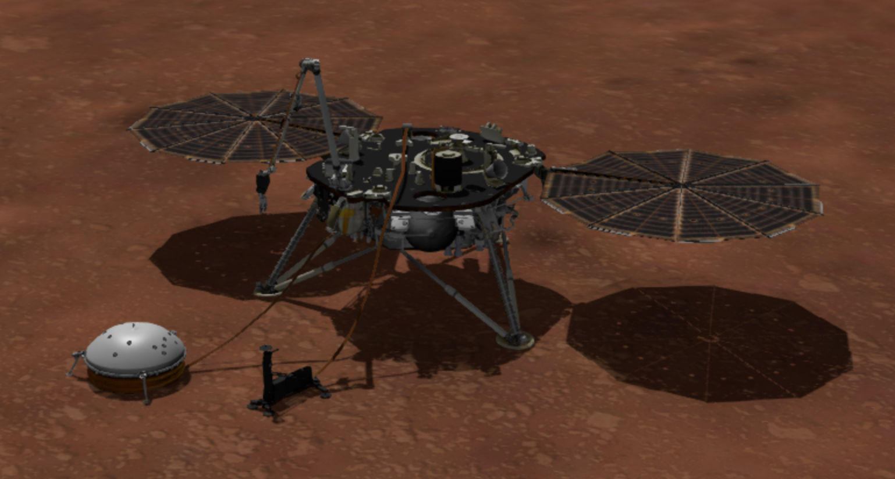

      
      

# README

### by Jeanette Schulz 
### 24 January 2022

    

 

# Project Description
### What Is InSight?
InSight, short for Interior Exploration using Seismic Investigations, Geodesy and Heat Transport, is the first outer space robotic explorer to study the crust, mantle, and core of Mars. InSight landed November 26, 2018 on the surface of Mars at <b>Elysium Planitia</b>, a flat, smooth plain near Mars’ equator. Although not its main mission, The data collected by InSight should provide the components for an effective weather station at <b>Elysium Planitia</b>. The main components of the instrument package are the <i>Seismic Experiment for Interior Structure</i> (SEIS) and the <i>Heat-Flow and Physical Properties Probe </i>(HP3). They are supported by the <i>Auxiliary Payload Sensor Subsystem</i> (APSS), which includes temperature, wind and pressure sensors and a magnetometer. Altogether, InSight contains a highly sensitive pressure sensor (PS), and temperature and wind detectors (TWINS), combined with the radiometer (RAD) instrument, which will measure the surface brightness temperature, and a camera with multiple filters (IDC), which can be used to quantify atmospheric opacity. As a weather station, InSight provides a more continuous and higher-frequency record of pressure, air temperature and winds at the surface of Mars than previous missions.

     

    
### What is this about?
While InSight's main mission is to study the core of Mars, its support sensors are also collecting "weather data" to assist the main components in thier mission. By studying this data, I hope to find patterns that might allow me to forecast the weather for <b>Elysium Planitia</b>. If a Mars weather prediction model can be created with a high confidence level, this could be used in the Approach phase of future missions. The Approach phase is the beginning of intensive preparations before the spacecraft has entered the Martian atmosphere. This phase is where NASA engineers try ensure a successful entry, descent, and landing of thier lander. By predicting the weather in the Approach phase before landing, future NASA engineers can have even more confidence that thier next phase, the Landing phase, will be a success.

 

# Project Goal
Using some of the sensor data collected by InSight, the goal of this project is to see if I can find patterns that will allow me to predict future weather over <b>Elysium Planitia</b> on Mars. Deliver for this project will include a Final Report and a repository of my work.

 

# Project Planning
## Plan -> Acquire -> Prepare -> Explore -> Model & Evaluate -> Deliver

<b>Planning:</b>  
- Make sure the data is accessible
- Create a repository to save all my work
- Write a README file with a plan (check!)

<b>Acquisition </b>  
- Collect the data through web scraping 'https://atmos.nmsu.edu/data_and_services/atmospheres_data/INSIGHT/insight.html'
- Combine and save the data into a single csv
- Create a `wrangle.py` file to make future acquisition easier

<b>Preparation</b>  
- Organize my repository for easy navigation
  - Images directory to hold all photos used
  - Scrapbook directory to hold all work done

- Clean acquired "Mars Weather" data:
  - boop
  - boop
- Create a scale function for future modeling 
- Create split function for future modeling
- Add all new functions to `wrangle.py`

<b>Exploration and Pre-processing</b>  
- Split data appropriately 
- Explore the target variable using visualization and statistical testing
- Summarize takeaways and conclusions

<b>Modeling</b>  
- Establish and evaluate baseline model
- Create at least 4 different models and compare their performance. 

<b>Deliver</b>  
- A `Final_Report.ipynb` to explain my findings and results.

 

# Data Dictionary for twins_raw cvs'

|System          |  # | Column  |Data Type              | Description                                         |
|:---------------|:---|:--------|:----------------------|:----------------------------------------------------|
|Time References |  1 | AOBT    |ASCII_Real             | APSS Onboard Time
|                |  2 | SCLK    |ASCII_Real             | Spacecraft Clock
|                |  3 | LMST    |ASCII_String           | Local Mean Solar Time
|                |  4 | LTST    |ASCII_String           | Local True Solar Time
|                |  5 | UTC     |ASCII_Date_Time_DOY_UTC| Coordinated Universal Time
|================|====|=========|=======================|=====================================================|
| BOOM -Y        |  6 | BMY_2L_TEMP_1 | ASCII_Integer | WS transducer 1 PCB temperature PT-1000 PRT |
|                |  7 | BMY_2L_TEMP_2 | ASCII_Integer | WS transducer 2 PCB temperature PT-1000 PRT | 
|                |  8 | BMY_2L_TEMP_3 | ASCII_Integer | WS transducer 3 PCB temperature PT-1000 PRT |
|                |  9 | BMY_2L_TEMP_4 | ASCII_Integer | ATS-mid-rodtemperature: PT1000 PRT sensor located at an intermediate position in the ATS rod|
|                | 10 | BMY_2L_TEMP_4_AVERAGE | ASCII_Integer | ATS-mid-rod temperature average of the last N samples
|                | 11 | BMY_2L_TEMP_4_STD     | ASCII_Integer | ATS-mid-rod temperature standard deviation of the last N samples
|                | 12 | BMY_2L_TEMP_5         | ASCII_Integer | Boom Housing Temp: PT-1000 PRT located at the Boom housing near the base of the ATS rod
|                | 13 | BMY_2L_TEMP_6         | ASCII_Integer | Calibration resistor: 1K ohm
|                | 14 | BMY_AIR_TEMP | ASCII_Integer | ATS-rod-extreme temperature: PT1000 PRT located at ATS extreme
|                | 15 | BMY_AIR_TEMP_AVERAGE  | ASCII_Integer | ATS-rod-extreme temperature average of the last N samples
|                | 16 | BMY_AIR_TEMP_STD | ASCII_Integer | ATS-rod-extreme temperature standard deviation of the last N samples
|                | 17 | BMY_WD_REF_OUT_1 | ASCII_Integer | WS transducer 1 cold die temperature
|                | 18 | BMY_WD_REF_OUT_2 | ASCII_Integer | WS transducer 2 cold die temperature
|                | 19 | BMY_WD_REF_OUT_3 | ASCII_Integer | WS transducer 3 cold die temperature
|                | 20 | BMY_WD_OUT_1     | ASCII_Integer | Number of counts measured for WS channel 1
|                | 21 | BMY_WD_OUT_2     | ASCII_Integer | Number of counts measured for WS channel 2
|                | 22 | BMY_WD_OUT_3     | ASCII_Integer | Number of counts measured for WS channel 3
|                | 23 | BMY_WD_OUT_4     | ASCII_Integer | Number of counts measured for WS channel 4
|                | 24 | BMY_WD_OUT_5     | ASCII_Integer | Number of counts measured for WS channel 5
|                | 25 | BMY_WD_OUT_6     | ASCII_Integer | Number of counts measured for WS channel 6
|                | 26 | BMY_WD_OUT_7     | ASCII_Integer | Number of counts measured for WS channel 7
|                | 27 | BMY_WD_OUT_8     | ASCII_Integer | Number of counts measured for WS channel 8
|                | 28 | BMY_WD_OUT_9     | ASCII_Integer | Number of counts measured for WS channel 9
|                | 29 | BMY_WD_OUT_10    | ASCII_Integer | Number of counts measured for WS channel 10
|                | 30 | BMY_WD_OUT_11    | ASCII_Integer | Number of counts measured for WS channel 11
|                | 31 | BMY_WD_OUT_12 | ASCII_Integer | Number of counts measured for WS channel 12
|                | 32 | BMY_ASIC_TEMP | ASCII_Integer | ASIC temperature
|                | 33 | BMY_AIR_TEMP_FREQUENCY | ASCII_String | Air temperature channels frequency or frequencies
|                | 34 | BMY_WIND_FREQUENCY | ASCII_String | Wind channels frequency or frequencies
|================|====|=========|=======================|=====================================================|
| BOOM +Y        | 35 | BPY_2L_TEMP_1 | ASCII_Integer | WS transducer 1 PCB temperature PT-1000 PRT
|                | 36 | BPY_2L_TEMP_2 | ASCII_Integer | WS transducer 2 PCB temperature PT-1000 PRT
|                | 37 | BPY_2L_TEMP_3 | ASCII_Integer | WS transducer 3 PCB temperature PT-1000 PRT
|                | 38 | BPY_2L_TEMP_4 | ASCII_Integer | Calibration resistor: 1K ohm
|                | 39 | BPY_2L_TEMP_5 | ASCII_Integer | ATS-mid-rod temperature: PT1000 PRT sensor located at a intermediate position in the ATS rod
|                | 40 | BPY_2L_TEMP_5_AVERAGE | ASCII_Integer | ATS-mid-rod temperature average of the last N samples
|                | 41 | BPY_2L_TEMP_5_STD | ASCII_Integer | ATS-mid-rod temperature standard deviation of the last N samples
|                | 42 | BPY_2L_TEMP_6 | ASCII_Integer | Boom Housing Temp: PT-1000 PRT located at the Boom housing near the base of the ATS rod
|                | 43 | BPY_AIR_TEMP | ASCII_Integer | ATS-rod-extreme temperature: PT1000 PRT located at ATS extreme
|                | 44 | BPY_AIR_TEMP_AVERAGE | ASCII_Integer | ATS-rod-extreme temperature average of the last N samples
|                | 45 | BPY_AIR_TEMP_STD | ASCII_Integer | ATS-rod-extreme temperature standard deviation of the last N samples
|                | 46 | BPY_WD_REF_OUT_1 | ASCII_Integer | WS transducer 1 cold die temperature
|                | 47 | BPY_WD_REF_OUT_2 | ASCII_Integer | WS transducer 2 cold die temperature
|                | 48 | BPY_WD_REF_OUT_3 | ASCII_Integer | WS transducer 3 cold die temperature
|                | 49 | BPY_WD_OUT_1     | ASCII_Integer | Number of counts measured for WS channel 1
|                | 50 | BPY_WD_OUT_2     | ASCII_Integer | Number of counts measured for WS channel 2
|                | 51 | BPY_WD_OUT_3     | ASCII_Integer | Number of counts measured for WS channel 3
|                | 52 | BPY_WD_OUT_4     | ASCII_Integer | Number of counts measured for WS channel 4
|                | 53 | BPY_WD_OUT_5     | ASCII_Integer | Number of counts measured for WS channel 5
|                | 54 | BPY_WD_OUT_6     | ASCII_Integer | Number of counts measured for WS channel 6
|                | 55 | BPY_WD_OUT_7     | ASCII_Integer | Number of counts measured for WS channel 7
|                | 56 | BPY_WD_OUT_8     | ASCII_Integer | Number of counts measured for WS channel 8
|                | 57 | BPY_WD_OUT_9     | ASCII_Integer | Number of counts measured for WS channel 9
|                | 58 | BPY_WD_OUT_10    | ASCII_Integer | Number of counts measured for WS channel 10
|                | 59 | BPY_WD_OUT_11    | ASCII_Integer | Number of counts measured for WS channel 11
|                | 60 | BPY_WD_OUT_12    | ASCII_Integer | Number of counts measured for WS channel 12
|                | 61 | BPY_ASIC_TEMP    | ASCII_Integer | ASIC temperature
|                | 62 | BPY_AIR_TEMP_FREQUENCY | ASCII_String |Air temperature channels frequency or frequencies
|                | 63 | BPY_WIND_FREQUENCY | ASCII_String | Wind channels frequency or frequencies

 

# Steps to Reproduce

To run the `Final_Report.ipynb` notebook on your own computer you will need to:

 1. Read this README.md (check!)
 2. Ensure you have 3GB of storage space available
 3. Download the whole repository 
 8. Run the `Final_Report.ipynb` in a jupyter notebook

 

# Initial Questions for the Project

1. Does <b>Elysium Planitia</b> have seasons?
2. With no water cycle, is weather easier to predict?
3. Does <b>Elysium Planitia</b> have weather anomalies like tornadoes?
4. 
